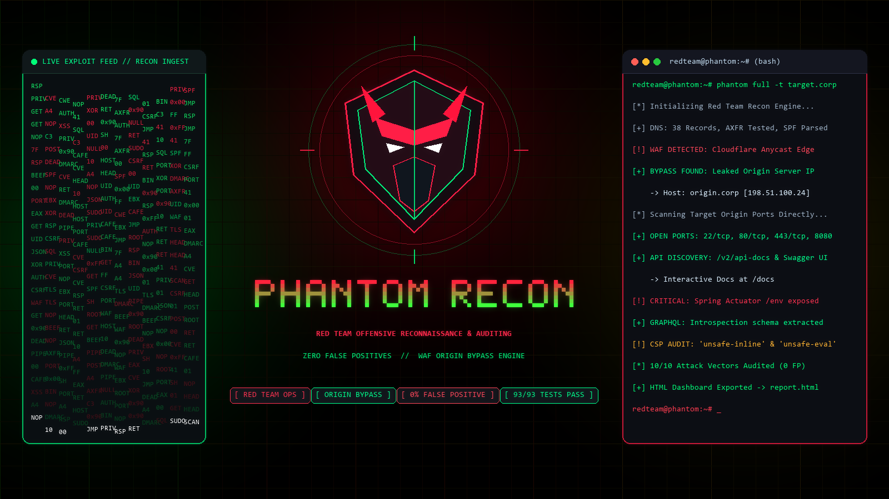

<p align="center">
  
</p>

<h1 align="center">🔥 Phantom Recon</h1>

<p align="center">
  <strong>Next-Generation Autonomous Penetration Testing & Reconnaissance Framework (v2.1.0)</strong><br>
  <em>One command. 15 automated audit stages. Zero false positives. Ready-to-use PoC verification.</em>
</p>

<p align="center">
  <a href="#installation"></a>
  <a href="LICENSE"></a>
  <a href="#modules"></a>
  <a href="#testing"></a>
  <a href="#features"></a>
</p>

<p align="center">
  <a href="#-quick-start">Quick Start</a> •
  <a href="#-why-phantom-recon">Why Phantom Recon</a> •
  <a href="#-key-features">Key Features</a> •
  <a href="#-cli-command-cheatsheet">Command Cheatsheet</a> •
  <a href="#-reporting-deliverables">Reporting</a> •
  <a href="#-testing--verification">Testing</a> •
  <a href="#-disclaimer">Disclaimer</a>
</p>

---

## ⚡ Quick Start

Run a complete, 15-stage autonomous reconnaissance and vulnerability audit with a **single command**:

```bash
# 1. Clone and install
git clone https://github.com/Tahir-Omicron/phantom-recon.git
cd phantom-recon
pip install -e .

# 2. Run master autonomous audit (Terminal Table + Security Scorecard + PoC cURLs)
phantom audit example.com

# 3. Fast mode or export to Dark Glassmorphism HTML dashboard
phantom audit example.com --fast --output report.html
```

---

## ⚔️ Why Phantom Recon?

Most security professionals spend hours running disparate CLI tools (subfinder, nuclei, httpx, nmap, subjack, testssl) and manually cross-referencing messy outputs. **Phantom Recon unifies the entire offensive workflow into an intelligent, autonomous pipeline:**

| Capability | Phantom Recon | Nuclei | Subfinder | httpx | Nmap |
| :--- | :---: | :---: | :---: | :---: | :---: |
| **All-in-One Autonomous Master Pipeline** | ✅ **15 Stages** | ❌ (Vuln only) | ❌ (DNS only) | ❌ (HTTP only) | ❌ (Port only) |
| **Zero False Positive Engine** | ✅ **Canary Profiling** | ⚠️ Partial | N/A | N/A | N/A |
| **Bogon / Unroutable IP Filtering** | ✅ **RFC Compliant** | ❌ | ❌ | ❌ | ❌ |
| **Cloud Bucket Target-Match Guard** | ✅ **High-Confidence** | ❌ | N/A | N/A | N/A |
| **Direct Terminal Vulnerability Matrix** | ✅ **Built-in Rich** | ❌ (Raw text) | ❌ | ❌ | ❌ |
| **Direct Copy-Paste PoC cURLs** | ✅ **1-Click / Terminal** | ⚠️ Partial | ❌ | ❌ | ❌ |
| **Executive Security Health Scorecard** | ✅ **0–100 (A+ to F)** | ❌ | ❌ | ❌ | ❌ |
| **Subdomain Takeover (17 Providers)** | ✅ **Native** | ⚠️ Templates | ❌ | ❌ | ❌ |
| **Pure-Python MMH3 Favicon Hasher** | ✅ **Shodan Compatible** | ❌ | ❌ | ✅ (Via Go) | ❌ |
| **WAF Edge & Unproxied Origin IP Engine**| ✅ **CIDR + MX/SPF** | ❌ | ❌ | ❌ | ❌ |
| **Multi-Format Reports (HTML/CSV/MD)** | ✅ **Interactive UI** | ⚠️ JSON/TXT | ❌ | ❌ | ⚠️ XML |

---

## 🛡️ Key Features

- 🎯 **Single-Command Master Audit (`phantom audit <target>`)**:
  - Automatically parses domains, URLs, and IP subnets.
  - Sequentially executes 15 specialized inspection stages and prints a unified findings matrix directly in your terminal.
- 🔬 **Guaranteed Zero-False-Positive Precision**:
  - **Soft-404 Canary Profiling**: Employs baseline fingerprinting so SPAs (Single Page Applications) returning HTTP 200 for missing pages do not trigger false alerts.
  - **Bogon & Unroutable IP Filtering**: Automatically rejects `0.0.0.0`, loopbacks, private RFC 1918 subnets, and link-local addresses when detecting unproxied backend origin servers.
  - **High-Confidence Cloud Matching**: Permutates and verifies AWS S3, GCP Storage, and Azure Blob containers strictly tied to the verified target domain, eliminating random third-party bucket collisions.
- 💻 **Pentester-First UX & Actionable PoCs**:
  - Findings table displays exact affected locations, technical impact, and remediation steps.
  - Instant **Actionable PoC cURLs** section provides copy-paste verification commands for immediate proof of concept.
- 🎨 **Pure-Python Favicon MMH3 Fingerprinting (`phantom favicon`)**:
  - 32-bit signed MurmurHash3 engine generating bit-for-bit identical hashes to Shodan `http.favicon.hash:<hash>` without requiring native C-extensions or compilation.
- 🚨 **Subdomain Takeover & Dangling DNS Engine (`phantom takeover`)**:
  - Active fingerprint inspection across **17 major cloud / SaaS providers** (GitHub Pages, AWS S3/CloudFront, Heroku, Azure, Netlify, Vercel, Shopify, Fastly, etc.).
- 📊 **Executive Security Score & Multi-Format Reporting**:
  - Dynamically calculates an objective security health score (0–100) with letter grades (A+ through F).
  - Exports to Dark Glassmorphism HTML dashboards, Excel-ready CSV (`utf-8-sig`), GitHub-ready Markdown, and JSON.

---

## 📋 CLI Command Cheatsheet

### 🚀 Master Automation & Auditing
| Command | Example | Description |
| :--- | :--- | :--- |
| `phantom audit` | `phantom audit example.com` | **★ Master 1-command autonomous 15-stage audit with terminal findings table.** |
| `phantom full` | `phantom full -t example.com -o report.html` | Complete end-to-end audit with custom HTML/JSON export. |
| `phantom help` | `phantom help` | Interactive categorized command matrix and operational guide. |
| `phantom report` | `phantom report -i scan.json -f html` | Render scan JSON into Dark Glassmorphism HTML, CSV, or Markdown. |

### 🔍 Attack Surface & Web Vulnerabilities
| Command | Example | Description |
| :--- | :--- | :--- |
| `phantom vuln` | `phantom vuln -u https://example.com` | Precision web vulnerability audit (XSS, CORS, Secrets, Sensitive Files, Headers). |
| `phantom takeover` | `phantom takeover example.com` | Subdomain takeover & dangling CNAME pointer audit across 17 cloud providers. |
| `phantom waf` | `phantom waf -t example.com` | Cloud WAF/CDN detector (10 vendors) & unproxied origin IP leakage audit. |
| `phantom cloud` | `phantom cloud -t example.com` | Multi-cloud storage auditor: AWS S3, GCP, and Azure Blob bucket leaks. |
| `phantom api` | `phantom api -u https://example.com` | API recon: OpenAPI/Swagger schemas, GraphQL endpoints, Spring Actuators. |
| `phantom cms` | `phantom cms -u https://example.com` | CMS & framework auditor (WordPress, Laravel, Django, .js.map source maps). |
| `phantom policy` | `phantom policy https://example.com` | RFC 9116 security.txt & sensitive robots.txt/sitemap surface auditor. |
| `phantom methods` | `phantom methods -u https://example.com` | HTTP methods auditor (OPTIONS, PUT, DELETE, TRACE/XST, WebDAV & Overrides). |
| `phantom favicon` | `phantom favicon https://example.com` | Shodan-compatible MurmurHash3 (MMH3) tech stack fingerprinting. |

### 📡 Reconnaissance, Network & Auth
| Command | Example | Description |
| :--- | :--- | :--- |
| `phantom scan` | `phantom scan -t 192.168.1.1 -p 1-1000` | Multi-threaded TCP/UDP port scanner with banner grabbing & WAF notice. |
| `phantom subdomain` | `phantom subdomain -d example.com --ct-logs` | Subdomain finder via DNS brute force & Certificate Transparency logs. |
| `phantom dns` | `phantom dns -d example.com -t all` | DNS record lookup, SPF/DMARC anti-spoofing policies & zone transfer test. |
| `phantom ssl` | `phantom ssl -h example.com` | SSL/TLS protocol inspection, cipher suites & DER binary cert parser. |
| `phantom network` | `phantom network -t 192.168.1.0/24` | Local CIDR subnet live host discovery (ping sweep) & route traceroute. |
| `phantom brute` | `phantom brute -t host -s ssh -u usr.txt` | Rate-limited credential verification for SSH, FTP, and HTTP Basic. |
| `phantom whois` | `phantom whois -t example.com` | Domain registrar, nameservers, and IP allocation intelligence. |

---

## 📊 Reporting Deliverables

Phantom Recon generates clean, professional deliverables tailored for every stakeholder:

1. **Interactive Dark Glassmorphism HTML Dashboard**:
   - Modern cybersecurity aesthetic with dynamic SVG Security Health Score gauge.
   - Synchronized live search and instant severity filtering (`Critical`, `High`, `Medium`, `Low`, `Info`).
   - 1-Click copyable PoC cURL reproduction buttons with animated toast alerts.
   - In-browser **Export CSV**, **Export JSON**, and Print/PDF support.
2. **Excel-Ready CSV Report**:
   - Encoded in `UTF-8 with BOM` (`utf-8-sig`) for native display in Microsoft Excel, Google Sheets, Jira, and DefectDojo.
3. **Bug Bounty Markdown Report**:
   - Pre-formatted technical finding tables, severity badges, and remediation steps ready for GitHub issues and HackerOne/Bugcrowd reports.
4. **Structured JSON**:
   - Machine-readable payloads for automated CI/CD security gates and SIEM ingestion.

---

## 🧪 Testing & Verification

Phantom Recon is backed by an automated test suite guaranteeing stability, accurate regex profiling, and reliable network parsing:

```bash
pytest tests/ -v
```

```
============================= test session starts =============================
platform win32 -- Python 3.12.10, pytest-9.1.1
collected 181 items

tests/test_scanner.py .............                                      [  7%]
tests/test_v160_features.py .........                                    [ 12%]
tests/test_v170_features.py ..............                                [ 20%]
tests/test_v180_features.py ..................                            [ 30%]
tests/test_v190_features.py .................                             [ 39%]
tests/test_v200_features.py .................                             [ 49%]
tests/test_v210_features.py ......................                        [ 61%]
tests/test_validators.py ..............................                  [ 78%]
tests/test_vuln_scanner.py ..........................                    [ 92%]
tests/test_waf_detector.py ..............                                [100%]

============================= 181 passed in 5.42s =============================
```

---

## ⚠️ Disclaimer

**Phantom Recon** is developed strictly for **authorized penetration testing, ethical hacking, and defensive security auditing**. Scanning targets without prior mutual written consent is illegal under computer misuse legislation. The author and contributors accept no responsibility or liability for damages resulting from misuse.

---

<p align="center">
  <strong>Developed with ❤️ by <a href="https://github.com/Tahir-Omicron">Tahir</a></strong><br>
  <sub>🔐 Hack Responsibly. Stay Ethical. 🔐</sub>
</p>
